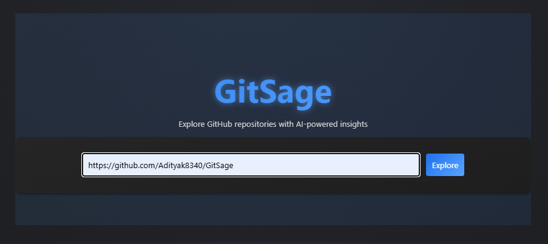
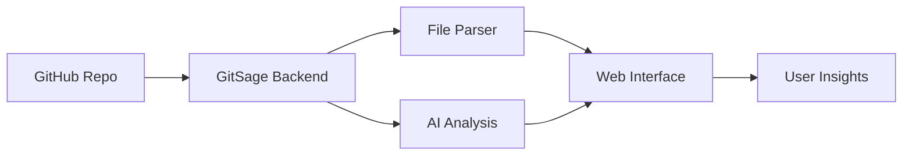

<div align="center">
  
  <h1 style="color: #58a6ff;">🔍 GitSage</h1>
  <p><i>Your AI-powered GitHub repository explorer!</i></p>

  [](https://www.python.org/downloads/)
  [](https://fastapi.tiangolo.com/)
  [](https://github.com/adityak8340/GitSage)
  [](https://groq.com)
</div>

<div align="center">
  
</div>

---

<div align="center" style="margin: 30px 0;">
  <h3 style="color: #58a6ff;">✨ Features</h3>
</div>

- 🔍 **Interactive Explorer**: Navigate repository files with ease
- 🤖 **AI Analysis**: Get instant code explanations and insights
- 💬 **Smart Chat**: Ask questions about any code file
- 🎨 **Modern UI**: Dark mode interface with smooth animations
- 📊 **Code Metrics**: Analyze complexity and patterns
- ⚡ **Real-time**: Instant file viewing and parsing

---

<div align="center" style="margin: 30px 0;">
  <h3 style="color: #58a6ff;">🚀 Quick Start</h3>
</div>

1. **Clone the repository**
```bash
git clone https://github.com/adityak8340/GitSage.git
cd GitSage
```

2. **Set up virtual environment**
```bash
python -m venv venv
source venv/bin/activate  # On Windows: venv\Scripts\activate
```

3. **Install dependencies**
```bash
pip install -r requirements.txt
```

4. **Configure environment**
```properties
GITHUB_TOKEN="your-github-token"
GROQ_API_KEY="your-groq-api-key"
```

5. **Run the application**
```bash
python run.py
```

Visit `http://localhost:8000` in your browser 🌐

---

<div align="center" style="margin: 30px 0;">
  <h3 style="color: #58a6ff;">🛠️ Architecture</h3>
</div>



---

<div align="center" style="margin: 30px 0;">
  <h3 style="color: #58a6ff;">💡 Usage Example</h3>
</div>

<div style="width: 100%; background-color: #1a1a1a; padding: 15px; border-radius: 6px;">

```python
# Just paste a GitHub repository URL
"https://github.com/username/repo"

# GitSage provides instant insights
"💡 Analysis shows this is a Python web application 
 with FastAPI backend. Main features include..."
```

</div>

---

<div align="center" style="margin: 30px 0;">
  <h3 style="color: #58a6ff;">🔮 Coming Soon</h3>
</div>

- [ ] Repository comparison tools
- [ ] Code quality scoring
- [ ] Multiple AI model support
- [ ] Team collaboration features
- [ ] Custom analysis plugins
- [ ] Repository issue tracking and PR automation

---

<div align="center">
  <div class="tech-stack" style="display: flex; justify-content: center; gap: 20px; margin: 20px 0;">
    
    
    
    
  </div>
</div>

<div align="center">
    <br>
    
    <p align="center">
        
        
        
    </p>
</div>
